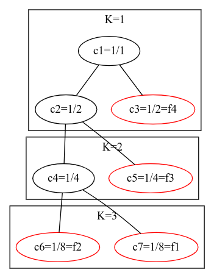

# ממן 12 

**קורס** אלגוריתמים, 20417 

**מגיש** טל גלנצמן, 302800354

**תאריך** 14-04-2021, סמסטר 2021ב

## שאלה 1

### סעיף א

נוכיח באינדוקציה על אורך המסלול $P_{s,v}$.

- **|P_{s,v}|=1** 

המסלול בעל צלע אחת ולכן לא קיים מסלול אחר מ-s ל-v ,אזי $P_{s,v}$ מזערי באופן טריוויאלי. 

- **|P_{s,v}|=k**

נסמן את צלעות המסלול והצמתים ע"י
\begin{align*}
    P_{s,v} &= (e_1, e_2, ..., e_k) \\
            &= ((s, p_1), (p_1, p_2), ..., (p_{k-2}, p_{k-1}),(p_{k-1}, v))
\end{align*}

מהנתון, כל הצלעות $e_1, e_2, ..., e_k$ שימושיות. בפרט, $e_1, e_2, ..., e_{k-1}$ שימושיות, מה שאומר עפ"י הנחת האינדוקציה שהמסלול $P_{s,p_{k-1}}$ הוא מזערי.

### סעיף ב

מיידי מתוקף ההגדרה

### סעיף ג

יותר קשה
- שאין, זה נובע מ-ב
- צריך להוכיח שלא יותר

### סעיף ד

פשוט, מהגדרות

### סעיף ה

וריאציה על דייקסטרה - להיעזר בסעיף ג

## שאלה 2

## שאלה 4

יהי T עץ מושרש בינארי לחלוטין בעל K רמות.

נסמן את כל m צמתי העץ, כולל העלים, ב- $t_1, t_2, ..., t_m$ עפ"י סדר הופעתם בסריקה לרוחב.

לכל $i \in \{1, 2, ..., m\}$ נסמן ב- $k_i$ את רמת הצומת $t_i$ ב-T (רמת השורש היא 0) ונסמן $c_i = \frac{1}{2^{k_i}}$ .

נסמן סדרת שכיחויות $f_1, f_2, ..., f_n$ להיות התת-סדרה של $c_i$ המכילה רק איברים $c_j$ כך שהצומת $t_j$ היא עלה.

הפעלת קידוד הופמן על הסדרה $f_1, f_2, ..., f_n$ תיתן עץ תחיליות T' השקול ל-T עד כדי סדר הופעות הצמתים באותה רמה, שהרי הסדרה $c_i$ מבטאת את השכיחיות של אותיות השפה המקורית ושפות הביניים הנוצרות ע"י איחוד אותיות ושכיחותיהן בעת הפעלת האלגוריתם.

