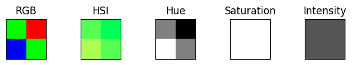
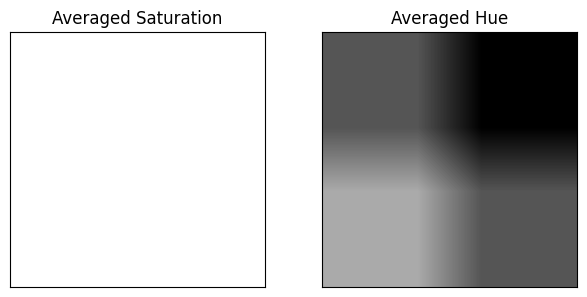
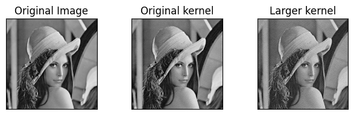

# Answer to 1

[Link to code](https://github.com/tglanz/bsc/blob/master/2024c-22913/mmn11/q1.ipynb)

## a)



**Hue component**. There are 4 blocks, each corresponds to a block of the RGB image. In general, we see that the Hues corresponding to different Red/Green/Blue color are different. The top left and top right blocks are equal since they both arise from the Green color. The top right and bottom left corresponds to the Hue of the Red and Blue colors respectively.

**Saturation** values are $1$. Hence, the component is white.

**Intensity** values are $\frac{1}{3}$. Hence, the component is gray ($1/3$ of the way from black to white).

## b + c)



Because the Saturation is constant, the average is constant as well with the average equal to the constant value $1$. Therefore the averaged component is completely white.

The Hue averaging strode between 4 constant values blocks, each of size $250 \times 250$. Therefore, we can see that the $125 \times 125$ sized blocks at the outmost corners are the constant values themselves. The center is the averaging of the 4 blocks (the more towards the center the more equally weighted each block is).

# Answer to 2

The sensitivity to edges is caused because the error diffusion takes into account only neighbours of distance 1. To smooth the edges we can increase the kernel size so that the error will be diffused to farther pixels (which will also blur the image a bit as a side effect).

Below is a comparison between the Original image, an output of the Floyd and Steinberg algorithm using their proposed kernel and another output based on a larger kernel proposed by J. F. Jarvis, C. N. Judice and W.H. Ninke.

[Link to code](https://github.com/tglanz/bsc/blob/master/2024c-22913/mmn11/q2.ipynb)



For completeness, the kernels used:
$$
Original = \frac{1}{16} \begin{pmatrix}
- & \star & 7 \\
3 & 5 & 1
\end{pmatrix}
~~~~~~
Larger = \frac{1}{48} \begin{pmatrix}
- & - & \star & 7 & 5 \\
3 & 5 & 7 & 5 & 3 \\
1 & 3 & 5 & 3 & 1
\end{pmatrix}
$$

# Answer to 3

The code below can also be found [here](https://github.com/tglanz/bsc/blob/master/2024c-22913/mmn11/q3.py) with example [input](https://github.com/tglanz/bsc/blob/master/2024c-22913/mmn11/lena.png) and [output](https://github.com/tglanz/bsc/blob/master/2024c-22913/mmn11/lena.diffused.png).

An example of execution (lozd the image from `lena.png` and use `5` gray levels):

    python q3.py lena.png 5

```python
import sys
import cv2
import numpy as np

def parse_args(argv):
    """ Parse application arguments

    Script execution example:

        python q3.py lena.png 4

    First positional argument is "location". It indicates the path to the image to read.
    Default: "image.png"

    Second position argument is "m". It indicates the number of gray levels.
    Default: 5
    """
    argc = len(argv)
    if argc < 3:
        m = 5
    else:
        m = argv[2]

    if argc < 2:
        location = "image.png"
    else:
        location = argv[1]

    return (location, int(m))

def load_image(location):
    """ Loads the image from the given location """
    image = cv2.imread(location)
    if image.shape[2] == 3:
        image = cv2.cvtColor(image, cv2.COLOR_RGB2GRAY)
    return image

def create_palette(min_val, max_val, m):
    """ Create a palette of m equally spread gray values between min_value and max_value """
    step = (max_val - min_val) // (m - 1)
    palette = []

    while min_val <= max_val:
        palette.append(min_val)
        min_val += step
    
    return palette

def find_closest_palette_color(value, palette):
    """ Find the closest to value palette value """
    left = 0
    right = len(palette) - 1

    while left < right:
        d_left = abs(palette[left] - value)
        d_right = abs(palette[right] - value)

        if d_left <= d_right:
            right -= 1
        else:
            left += 1
    
    return palette[left]

def error_diffusion(image, m):
    """ Perform error diffusion on image with m gray levels """
    rows, cols = image.shape
    image = image.copy().astype(np.int16)
    palette = create_palette(0, 255, m)

    for y in range(rows):
        for x in range(cols):
            old_pixel = image[y, x]
            new_pixel = find_closest_palette_color(old_pixel, palette)

            image[y, x] = new_pixel
            error = old_pixel - new_pixel
            
            if x < cols - 1:
                image[y, x + 1] += error * 7.0 / 16.0

            if y < rows - 1:
                if x > 0:
                    image[y + 1, x - 1] += error * 3.0 / 16.0

                image[y + 1, x] += error * 5.0 / 16.0
                if x < cols - 1:
                    image[y + 1, x + 1] += error * 1.0 / 16.0

    return image.astype(np.uint8)

def main():
    location, m = parse_args(sys.argv)
    image = load_image(location)
    diffused_image = error_diffusion(image, m)
    cv2.imwrite(location.replace("png", "diffused.png"), diffused_image)

main()
```

# Answer to 4

We will show two colors $a$ and $b$ with the same saturation such that their complements have different saturation. We can then conclude that the saturation of the initial colors is not enough to determine the saturation of the complements.

Let $a$ and $b$ be two colors defined by

- $RGB(a) = (1, 0, 0)$
- $RGB(b) = (0, 0.59, 0)$

We compute the HSI values and get that

- $HSI(a) = (0, 1, 0.033)$
- $HSI(b) = (0.33, 1, 0.2)$

We will denote complement of some color $X$ by $x^c$ and notice that ${RGB(x^c) = (1, 1, 1) - RGB(x)}$. Therefore:

- $RGB(a^c) = (0, 1, 1)$
- $RGB(b^c) = (1, 0.41, 1)$

Computing the HSI values of the RGB complements we get that

- $HSI(a^c) = (0.5, 1, 0.66)$
- $HSI(b^c) = (0.83, 0.48, 0.8)$

What we can see from the above is that the saturation of the original colors $a$ and $c$ are both 1. However, the saturation of their complements are $1$ and $0.48$ respectively. This means that only the saturation of the initial color is not enough to determine the saturation of the complement color.