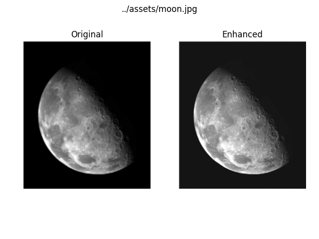

# Mmn12, 22913

Author: Tal Glanzman

Date: 2024/08/10

# Answer to 1

The following are the results of the code below




The code can also be found here: https://github.com/tglanz/bsc/blob/master/2024c-22913/mmn12/src/q1.py.

Note that I intentionally added a blur while loading the source image to make the sharpening more apparent, it is not part of the "algorithm".

```python
import cv2
import numpy as np
from matplotlib import pyplot as plt

def load_image(image_path):
    bgr = cv2.imread(image_path)
    bgr = cv2.resize(bgr, (512, int(512 * bgr.shape[0] / bgr.shape[1])))
    bgr = cv2.blur(bgr, (4, 4))
    gray = cv2.cvtColor(bgr, cv2.COLOR_BGR2GRAY)
    gray = gray / 255
    return gray

def create_laplacian_kernel(shape):
    P, Q = shape
    kernel = np.zeros((P, Q), dtype=np.float32)
    P_half = P / 2
    Q_half = Q / 2
    PI_square = np.pi * np.pi

    for u in range(P):
        for v in range(Q):
            d_uv = (u - P_half)**2 + (v - Q_half)**2
            kernel[u, v] = -4 * PI_square * d_uv

    return kernel

def normalize_tensor(tensor, minval, maxval):
    old_diff = tensor.max() - tensor.min()
    new_diff = maxval - minval
    return (tensor - tensor.min()) / old_diff * new_diff - 1

for image_name in ["moon", "dogs"]:
    # load the image
    image_path = f"../assets/{image_name}.jpg"
    image_spatial = load_image(image_path)

    # fft transform the image and shift it such that (0, 0) is in the center
    image_freq = np.fft.fft2(image_spatial)
    image_freq = np.fft.fftshift(image_freq)

    # create the laplacian kernel in the frequency domain
    kernel_freq = create_laplacian_kernel(image_spatial.shape)

    # calculate the laplacian and normalize it
    laplacian = kernel_freq * image_freq
    laplacian = np.fft.ifft2(np.fft.ifftshift(laplacian))
    laplacian = np.real(laplacian)
    laplacian = normalize_tensor(laplacian, -1, 1)

    # compute the enhanced image
    enhanced = image_spatial + (-1) * laplacian
    enhanced = np.clip(enhanced, 0, 1)
    enhanced *= 255

    # plot and compare the results
    plt.subplots(1, 2)
    plt.tight_layout()
    plt.suptitle(f"../assets/{image_name}.jpg")
    plt.subplot(1, 2, 1)
    plt.axis("off")
    plt.title("Original")
    plt.imshow(image_spatial, cmap="gray")
    plt.subplot(1, 2, 2)
    plt.axis("off")
    plt.title("Enhanced")
    plt.imshow(enhanced, cmap="gray")
    plt.savefig(f"../assets/{image_name}.comparison.png")
```

# Answer to 2

## 2.1

$$
\begin{matrix}
& & & -1 & 2 & -1 \\
3 & 4 & 2 & 1
\end{matrix}
$$

$\Rightarrow y_0 = -1 \cdot 1 = -1$

$$
\begin{matrix}
& & -1 & 2 & -1 \\
3 & 4 & 2 & 1
\end{matrix}
$$

$\Rightarrow y_1 = 2 \cdot 1 + (-1) \cdot 2 = 0$

$$
\begin{matrix}
& -1 & 2 & -1 \\
3 & 4 & 2 & 1
\end{matrix}
$$

$\Rightarrow y_2 = -1 \cdot 1 + 2 \cdot 2 + (-1) \cdot 4 = -1$

$$
\begin{matrix}
-1 & 2 & -1 \\
3 & 4 & 2 & 1
\end{matrix}
$$

$\Rightarrow y_3 = -1 \cdot 2 + 2 \cdot 4 + (-1) \cdot 3 = 3$

$$
\begin{matrix}
-1 & 2 & -1 \\
& 3 & 4 & 2 & 1
\end{matrix}
$$

$\Rightarrow y_4 = -1 \cdot 4 + 2 \cdot 3 = 2$

$$
\begin{matrix}
-1 & 2 & -1 \\
& & 3 & 4 & 2 & 1
\end{matrix}
$$

$\Rightarrow y_5 = -1 \cdot 3 = -3$

Therefore

$$
y = h \circledast x =
\begin{pmatrix} -1 \\ 2 \\ -1 \end{pmatrix}
\circledast
\begin{pmatrix} 1 \\ 2 \\ 4 \\ 3 \end{pmatrix}
=
\begin{pmatrix}
-1 \\ 0 \\ -1 \\ 3 \\ 2 \\ -3
\end{pmatrix}
$$

## 2.2

By definitions of the Fourier Pair

$$
f(x, y)
= \mathcal{F}^{-1}[\hat{f}(u, x)]
= \int_{-\infty}^{\infty} e^{- \frac{u^2 + v^2}{2 \sigma^2}} e^{j2\pi (ux + vy)} \mathrm{d}u \mathrm{d}v
= g(x) \cdot g(y)
$$

with $g(t)$ defined by:
$$
    g(t) = \int_{-\infty}^{\infty} e^{- \frac{\omega^2 - j4\pi\sigma^2t\omega}{2\sigma^2}} \mathrm{d}\omega
$$

Notice that by complementing to the square, we get that
$$
\omega^2 - j4\pi\sigma^2t\omega = (\omega - j2\pi\sigma^2 t)^2 + 4\pi^2\sigma^4 t^2
$$

and therefore
$$
g(t) 
= e^{- 2 \pi^2 \sigma^2 t^2} \cdot \int_{-\infty}^{\infty} e^{- \frac{(w - j2\pi \sigma t)^2}{2\sigma^2}} \mathrm{d}\omega
$$

By using the fact about Gaussian Integrals
$$
\int_{-\infty}^{\infty} e^{-a(t + b)^2}\mathrm{d}t = \sqrt{\frac{\pi}{a}}
$$

we compute
$$
\int_{-\infty}^{\infty} e^{- \frac{(\omega - j2\pi \sigma t)^2}{2 \sigma^2}} \mathrm{d}\omega = \sqrt{2 \sigma ^2 \pi} = \sigma \sqrt{2\pi}
$$

And we get that
$$
g(t) = \sigma \sqrt{2\pi} \cdot e^{- 2 \pi^2 \sigma^2 t^2}
$$

Finally, putting it all together we get that
$$
f(x, y) = g(x) \cdot g(y) = 2\pi \sigma^2 e^{- 2 \pi^2 \sigma^2 (x^2 + y^2)}
$$

as we wanted to show.

# Answer to 3

## 4.18

By definition of the discrete convolution 4-48:

$$
f(x) \ast h(x) = \sum_{m=0}^{M-1} f(m) h(x - m)
$$

Applying the DFT (4-44) we get that

$$
\begin{align*}
\mathcal{F}[f(x) \ast h(x)] &= \sum_{x=0}^{M-1} \sum_{m=0}^{M-1} f(m) h(x - m) e^{-2 \pi i ux/M} \\
&= \sum_{m=0}^{M-1} \sum_{x=0}^{M-1} f(m) h(x - m) e^{-2 \pi i ux/M} \\
&= \sum_{m=0}^{M-1} f(m) \sum_{x=0}^{M-1} h(x - m) e^{-2 \pi i ux/M} \\
\end{align*}
$$

By relying on the translation property of the DFT (problem 4.17) we get that

$$
\mathcal{F}[f(x) \ast h(x)] = \mathcal{F}[h(x)] \sum_{m=0}^{M-1} f(m) e^{-2\pi i um /M}
$$

Finally, by DFT definition we get 
$$
\mathcal{F}[f(x) \ast h(x)] = \mathcal{F}[h(x)] \cdot \mathcal{F}[f(x)]
$$

as we wanted to show.

## 4.20

We want to show that
$$
f(t_1, t_2) \ast \delta(t_1 - x_1, t_2 - x_2) = f(t_1 - x_1, t_2 - x_2)
$$

To make the solution clearer and only by notation, when there is no ambiguity we will use the letters $t, x, \tau$ and $u$ to indicate the two indices 1,2 of the same letter with expansion. For example, by writting $\delta(t - x)$ we mean ${\delta(t_1 - x_1, t_2 - x_2)}$ and by $du$ we mean $du_1du_2$.

By definition (integral limits are implicitly $(-\infty, \infty)$):
$$
\begin{align*}
f(t) \ast \delta(t - x) = \int \int f(\tau) \delta(t - x - \tau) d\tau
\end{align*}
$$

Substituting $u = t - x - \tau$:

- $\tau = t - x - u \Rightarrow d\tau = -1$
- $\tau \rightarrow -\infty \Rightarrow u \rightarrow \infty$
- $\tau \rightarrow \infty \Rightarrow u \rightarrow -\infty$

We get that
$$
\begin{align*}
f(t) \ast \delta(t - x) = \int \int f(t - x - u) \delta(u) du = f(t - x)
\end{align*}
$$

with the last equality is by definition of dirac's delta.

## 4.24

We want to show that
$$
    \mathcal{F}[a_1 f_1(x, y) + a_2 f_2(x, y)] = a_1 \mathcal{F}[f_1(x, y)] + a_2 \mathcal{F}[f_2(x, y)]
$$

**Continuous**

By definition (integral limits are implicitly $(-\infty, \infty)$):
$$
\begin{align*}
\mathcal{F}[a_1 f_1(x, y) + a_2 f_2(x, y)] &= \int \int (a_1 f_1(x, y) + a_2 f_2(x, y)) e^{-2\pi i (ux + vy)} dxdy \\
&= a_1 \int \int f_1(x, y) e^{-2 \pi i (ux + vy)} dx dy + a_2 \int \int f_2(x, y) e^{-2 \pi i (ux + vy)} dx dy \\
&= a_1 \mathcal{F}[f_1(x, y)] + a_2 \mathcal{F}[f_2(x, y)]
\end{align*}
$$

where the second equality arise from linearity of integration and the third equality arise from the definition of the 2d fourier transform.

**Discrete**

By definition
$$
\begin{align*}
\mathcal{F}[a_1 f_1(x, y) + a_2 f_2(x, y)] &=
\sum_{x=0}^{M-1} \sum_{y=0}^{N-1} (a_1 f_1(x, y) + a_2 f_2(x, y)) e^{-2\pi i (ux/M + vy/N)} \\
&= a_1 \sum_{x=0}^{M-1} \sum_{y=0}^{N-1} f_1(x, y) e^{-2\pi i (ux/M + vy/N)} + a_2 \sum_{x=0}^{M-1} \sum_{y=0}^{N-1} f_2(x, y) e^{-2\pi i (ux/M + vy/N)} \\
&= a_1 \mathcal{F}[f_1(x,y)] + a_2 \mathcal{F}[f_2(x, y)]
\end{align*}
$$

where the second equality arise from linearity of summation and the third equality arise from the definition of the 2d fourier transform.

# Answert to 4

Denote the box function in the interval $[-\frac{1}{2}, \frac{1}{2}]$ by
$$
g(t) = \begin{cases}
1 &  -\frac{1}{2} \leq t \leq \frac{1}{2} \\
0 & otherwise
\end{cases}
$$

We have learnt in class (lecture 2 with $X = 1$) that $\mathcal{F}[g(t)] = sinc(f)$. Therefore, by the duality principle we get that

$$
\mathcal{F}[sinc(-t)] = g(f)
$$

and because

$$
sinc(-t) = \frac{sin (- \pi t)}{- \pi t} = \frac{- sin(\pi t)}{-\pi t} = \frac{sin(\pi t)}{\pi t} = sinc(t)
$$

we get that

$$
\mathcal{F}[sinc(t)] = g(f)
$$

Now, by the convolution theorem:

$$
sinc(t) \ast sinc(t) = \mathcal{F}^{-1}[g(f) \cdot g(f)] =\mathcal{F}^{-1}[g(f)] = sinc(t)
$$

as we wanted to show.