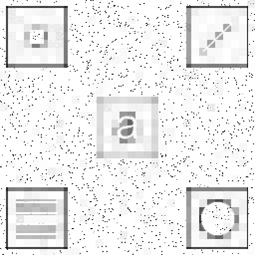

# Mmn13, 22913

Author: Tal Glanzman

Date: 2024/08/29

# Answer to 1

The algorithm's code is written below but can also be found here: https://github.com/tglanz/bsc/blob/master/2024c-22913/mmn13/q1.py.

The output image is shown in Figure 1.



> Note that I have used some builtin function for histogram creation and `cumsum` for CDF creation as I assumed they are not "at the heart" of the problem but rather the algorithm itself is. Ofcourse, the functions are implemented easily using accumulators and a single iteration.

```python
"""
The algorithm below performs an adaptive histogram equalization with contrast limiting.

1. It splits the image to strips of equal size
2. Strip by strip, perform histogram equalization with contrast limiting
"""
import cv2
import numpy as np

def limit_contrast(cdf: np.ndarray, contrast_limit: float):
    """ Applies a contrast limit to the given cdf

    The contrast limit is given as a ratio between min and max value.

    Clip the cdf within (0, contrast_limit) and then distribute the excess uniformly
    on the other bins.

    Note, that after filling the excess, it is possible that the cdf will again
    have bins that are above the contrast limit.

    The operation is done in place.
    """
    # convert from ratio to actual value
    contrast_limit = cdf.min() + (cdf.max() - cdf.min()) * contrast_limit

    # clip and track the excess
    excess = 0
    for i, v in enumerate(cdf):
        if v > contrast_limit:
            excess += v - contrast_limit
            cdf[i] = contrast_limit

    # distribute the excess
    cdf[:] = cdf + (excess / cdf.size)

def equalize(arr: np.ndarray, contrast_limit: int):
    """ Equalizes the histogram of the given array arr and apply contrast limiting.

    This operation is done inplace and we use slices to work on difference strips.
    """
    hist, _ = np.histogram(arr, 256, (0, 256))
    cdf = hist.cumsum()
    cdf = cdf / cdf.max() * 255
    limit_contrast(cdf, contrast_limit)
    cdf = cdf / cdf.max() * 255
    arr[:] = cdf[arr]

image = cv2.imread('./assets/embedded-squares.png', cv2.IMREAD_GRAYSCALE)

# limit the contrast to reduce some noise
contrast_limit = 0.9

# the size of the strips
kernel_width = 16
kernel_height = 16

for kernel_top in range(0, image.shape[0], kernel_height):
    for kernel_left in range(0, image.shape[1], kernel_width):
        strip = image[
            kernel_top:(kernel_top+kernel_height),
            kernel_left:(kernel_left+kernel_width)]
        equalize(strip, contrast_limit)

cv2.imwrite("output.png", image)
```

# Answer to 2

We will answer using two approaches.

**Apprach 1**

The rows of $A$ are the eigenvectors of $C_x$ which is an orthogonal set, and therefore $A$ is orthogonal which implies that
$$
    A^T=A^{-1}
$$

We can now write
$$
C_y = A C_x A^{-1}
$$

and notice that $C_y$ and $C_x$ are in fact Similar Matrices and it is well known that similar matrices have the same eigenvalues.

**Approach 2**

By construction and according to (11-52):

$$
C_y = diag(\lambda_i)
$$

where $\lambda_i$ are the eigen values of $C_x$.

We now that eigenvalues of diagonal matrices are the diagonal itself so we conclude that the eigenvalues of $C_y$ and $C_x$ are the same (and are $\lambda_i$)

# Answer to 3

From
$$
A \ominus B = \{ z | B_z \subseteq A \}
$$

we get that if $z \in A \ominus B$ then forall $b \in B$
$$
    z + b \in A
$$

Observe that according to the definition of translation we get that
$$
    A_{-b} = \{ a - b | a \in A \} = \{ x | x + b \in A \}
$$

so we conclude that $z \in A_{-b}$ for all $b \in B$ and therefore
$$
    A \ominus B \subseteq \bigcap_{b \in B} A_{-b}
$$

On the other hand, if $z \in \bigcap_{b \in B} A_{-b}$ then for all $b \in B$
$$
    z \in A_{-b}
$$

and with similar arguments we get that forall $z + b \in A$ and therefore by definition
$$
    B_z \subseteq A
$$

which means that $z \in A \ominus B$ so
$$
    \bigcap_{b \in B} A_{-b} \subseteq A \ominus B
$$

Because we have shown inclusion from both sides we conclude equality.

# Answer to 4

By convention, in all of the answers below we will notate:

$$
\sum_{x} = \sum_{x=0}^{M-1} ~~ ; ~~ \
\sum_{y} = \sum_{y=0}^{N-1} ~~ ; ~~ \
\sum_{u} = \sum_{u=0}^{M-1} ~~ ; ~~ \
\sum_{v} = \sum_{v=0}^{N-1} ~~ ; ~~ \
$$

We will also allow ourselves to use two variables under the same summation sign, meaning independent summations according to the above conventions. For example
$$
    \sum_{xy} = \sum_{x=0}^{M-1} \sum_{y=0}^{N-1}
$$

## a)
\begin{align*}
\mathcal{F}[\delta(x, y)] 
=& \sum_{xy}\delta(x, y) e^{-2\pi i (ux/M + vy/N)} && \text{By 4-67} \\
=& e^{-2\pi i (u0/M + v0/N)} && \text{By 4-58} \\
=& 1
\end{align*}

## b)
\begin{align*}
\mathcal{F}^{-1}[MN\delta(u,v)]
&= \frac{1}{MN} \sum_{uv} MN \delta(u,v) e^{2\pi i (ux/M + vy/N)} && \text{By 4-68} \\
&= e^{2\pi i (0x/M + 0y/N)} && \text{By 4-58} \\
&= 1
\end{align*}

## c)
\begin{align*}
\mathcal{F}[\delta(x-x_0, y-y_0)] 
=& \sum_{xy}\delta(x-x_0, y-y_0) e^{-2\pi i (ux/M + vy/N)} && \text{By 4-67} \\
=& e^{-2\pi i (ux_0/M + vy_0/N)} && \text{By 4-58}
\end{align*}

## d)
\begin{align*}
\mathcal{F}^{-1}[MN\delta(u-u_0,v-v_0)]
&= \frac{1}{MN} \sum_{uv} MN \delta(u-u_0,v-v_0) e^{2\pi i (ux/M + vy/N)} && \text{By 4-68} \\
&= e^{2\pi i (u_0x/M + v_0y/N)} && \text{By 4-58}
\end{align*}

## e)

Observe that
$$
\frac{e^{i\theta} + e^{-i\theta}}{2} = \frac{\cos(\theta) + i\sin(\theta) + \cos(-\theta) + i\sin(-\theta)}{2} = \cos(\theta)
$$

So
\begin{align*}
&\mathcal{F}[\cos(2\pi(u_0x/M + v_0y/N))] \\
&= \sum_{xy} \frac{e^{2\pi i (u_0x/M + v_0y/N)} + e^{- 2\pi i (u_0x/M + v_0y/N)} }{2} e^{- 2\pi i (ux/M + vy/N)} && \text{By 4-67} \\
&= \frac{1}{2} \sum_{xy} e^{2\pi i (u_0x/M + v_0y/N)} e^{- 2\pi i (ux/M + vy/N)} + \frac{1}{2} \sum_{xy} e^{- 2\pi i (u_0x/M + v_0y/N)} e^{- 2\pi i (ux/M + vy/N)} \\
&= \frac{MN}{2} \delta(u-u_0, v-v_0) + \frac{MN}{2} \delta(u+u_0, v+v_0) && \text{By answer to 4.d} \\
&= \frac{MN}{2} [ \delta(u+u_0, v+v_0) + \delta(u-u_0, v-v_0) ]
\end{align*}

## f)

Observe that
$$
\frac{e^{i\theta} - e^{-i\theta}}{2i} = \frac{\cos(\theta) + i\sin(\theta) - \cos(-\theta) - i\sin(-\theta)}{2i} = \sin(\theta)
$$

So
\begin{align*}
& \mathcal{F}[\sin(2\pi(u_0x/M + v_0y/N))] \\
&= \sum_{xy} \frac{e^{2\pi i (u_0x/M + v_0y/N)} - e^{- 2\pi i (u_0x/M + v_0y/N)} }{2i} e^{- 2\pi i (ux/M + vy/N)} && \text{By 4-67} \\
&= \frac{1}{2i} \sum_{xy} e^{2\pi i (u_0x/M + v_0y/N)} e^{- 2\pi i (ux/M + vy/N)} - \frac{1}{2i} \sum_{xy} e^{- 2\pi i (u_0x/M + v_0y/N)} e^{- 2\pi i (ux/M + vy/N)} \\
&= \frac{MN}{2i} \delta(u-u_0, v-v_0) - \frac{MN}{2i} \delta(u+u_0, v+v_0) && \text{By answer to 4.d} \\
&= \frac{i MN}{2} [ \delta(u+u_0, v+v_0) - \delta(u-u_0, v-v_0)]
\end{align*}