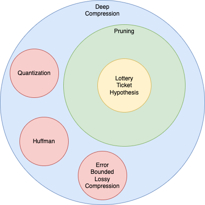

## Introduction

In this chapter, we will shallowly review the deep compression landscape. Our focus in this work is the Lottery Ticket Hypothesis and the lottery tickets themselves - The hypothesis uses pruning, which is a technique in the deep compression field. Therefore, we don't need to delve too much to other deep compression techniques, only review them to give a full picture.

{ width=50% }

- What is deep compression?
- Motivation for deep compression
- The standard deep compression pipeline
  - Pruning
  - Quantization
  - Huffman Coding
- Modern/Novel compression techniques
  - Error Bounded Lossy Compression 

Note: If, during writing the work, we find that there is not enough substance (focusing on pruning and the lottery ticket hypothesis alone), we can dive deeper into the other techniques as well.

## Pruning

The Lottery Ticket Hypothesis and the following tickets research, compare between different pruning approaches. Therefore, we need to fully grasp pruning before discussing the hypothesis.

- What is pruning?
  - Impact on Inference vs impact on Training
  - Sparsity in hardware
- Definitions
- Techniques
  - Weights, Neurons, Layers
  - Structured vs Unstructured
  - One Shot vs Iterative
  - Rewind

## The lottery ticket hypothesis

This chapter is the core of our work - Discuss the hypothesis and showcase further results.

- Initial hypothesis
- Adjustments for bigger networks
  - Linear mode connectivity
- Impact of the hypothesis
  - Practical
  - Theoretical: 
- Characteristics of a lottery ticket?

## References

> Note: All links below redirect to the Open University's library

- [Learning both Weights and Connections for Efficient Neural Networks. 2015](http://elib.openu.ac.il/login?url=https://search.ebscohost.com/login.aspx?direct=true&db=edsarx&AN=edsarx.1506.02626&site=eds-live&scope=site)

- [Deep Compression: Compressing Deep Neural Networks with Pruning, Trained Quantization and Huffman Coding. 2015](http://elib.openu.ac.il/login?url=https://search.ebscohost.com/login.aspx?direct=true&db=edsarx&AN=edsarx.1510.00149&site=eds-live&scope=site)

- [**The Lottery Ticket Hypothesis: Finding Sparse, Trainable Neural Networks. 2018**](http://elib.openu.ac.il/login?url=https://search.ebscohost.com/login.aspx?direct=true&db=edsarx&AN=edsarx.1803.03635&site=eds-live&scope=site)

- [DeepSZ: A Novel Framework to Compress Deep Neural Networks by Using Error-Bounded Lossy Compression. 2019](http://elib.openu.ac.il/login?url=https://search.ebscohost.com/login.aspx?direct=true&db=edsarx&AN=edsarx.1901.09124&site=eds-live&scope=site)

- [**Deconstructing Lottery Tickets: Zeros, Signs, and the Supermask. 2019**](http://elib.openu.ac.il/login?url=https://search.ebscohost.com/login.aspx?direct=true&db=edsarx&AN=edsarx.1905.01067&site=eds-live&scope=site)

- [A Survey on Deep Neural Network Compression: Challenges, Overview, and Solutions. 2020](http://elib.openu.ac.il/login?url=https://search.ebscohost.com/login.aspx?direct=true&db=edsarx&AN=edsarx.2010.03954&site=eds-live&scope=site)

- [**What is the State of Neural Network Pruning?. 2020**](http://elib.openu.ac.il/login?url=https://search.ebscohost.com/login.aspx?direct=true&db=edsarx&AN=edsarx.2003.03033&site=eds-live&scope=site)

- [**Gradient flow in sparse neural networks
and how lottery tickets win. 2020**](http://elib.openu.ac.il/login?url=https://search.ebscohost.com/login.aspx?direct=true&db=edsarx&AN=edsarx.2010.03533&site=eds-live&scope=site)

- [SONIC: A Sparse Neural Network Inference Accelerator with Silicon Photonics for Energy-Efficient Deep Learning. 2021](http://elib.openu.ac.il/login?url=https://search.ebscohost.com/login.aspx?direct=true&db=edsarx&AN=edsarx.2109.04459&site=eds-live&scope=site)

- [**Unmasking the Lottery Ticket Hypothesis: What's encoded in a Winning Ticket's Mask?. 2022**](http://elib.openu.ac.il/login?url=https://search.ebscohost.com/login.aspx?direct=true&db=edsarx&AN=edsarx.2210.03044&site=eds-live&scope=site)
