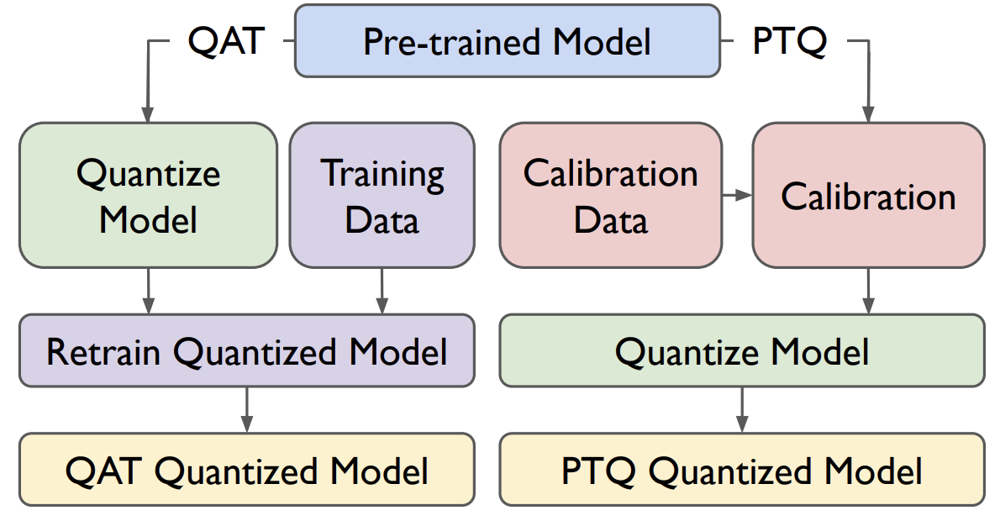
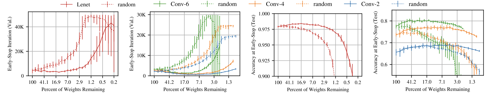
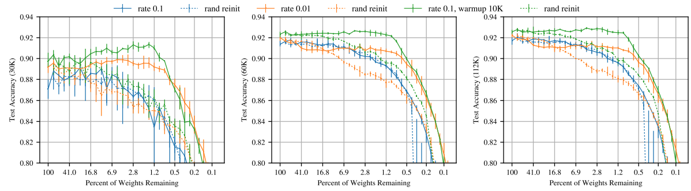
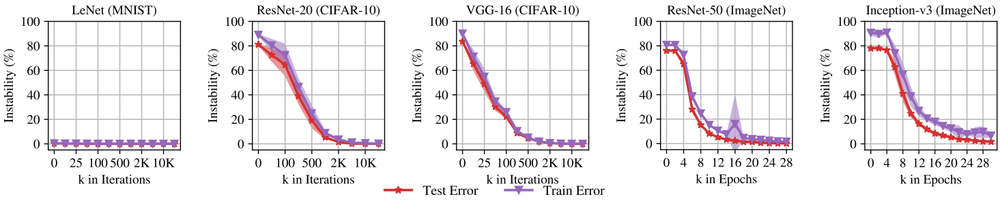

# Deep Learning

## Neural Networks

::: columns

:::: column
Machine Learning models that are composed of connected Layers of Neurons

Tasks:  

- Classification
- Regression
::::

:::: column

::::

:::

## Model

The Architecture of a NN $f$ is the structure, or the fixed set of operations to be performed on some input $x$:

$$
    f(x, \cdot)
$$

The specific parametrization $W$ of the weights (parameters) of the NN is the Model:

$$
    f(x, W)
$$

To infer an output $y$ we feed a model with an input $x$. We also say that $f$ predicted $y$.

## Training

**Training Set** is a set of $T =  (x_i, y_i)_{i=1}^n$ samples

**Training** is the process of minimizing a Loss Function $\tilde{L}(y, y')$ where $y' = f(x, W)$

**Accuracy** is the ratio of correct predictions of all predictions

**Generalization**: How accurate is the model with respect to unseen data?

## Batched Loss Functions

For modern training processes we define a loss function over a set of samples:

$$
    L(W) = \frac{1}{n} \sum_{i=1}^{n}{\tilde{L}(y_i, y')}
$$

A common loss function is the **Mean Squared Error**:

$$
    MSE(W) = \frac{1}{n} \sum_{i=1}^{n}{(y_i - f(x_i, W))^2}
$$

## Stochastic Gradient Descent

The common algorithm for such optimization is an *iterative* process known as the **Gradient Descent**:

$$
    W \leftarrow W - \mu \nabla L
$$

**Stochastic Gradient Descent (SDG)** - stochastic mini-batches

## Sparsity

Sparsity is the mearsument of how "empty" the model is:

$$
    Sparsity(f) = \frac{|\{ w \in W | w = 0 \}|}{|W|}
$$

&nbsp;

We say that a NN $f$ sparser than $g$ when

$$
    Sparsity(f) > Sparsity(g)
$$

# Model Compression

## What is model compression?

The process of reducing the size of a model while minimizing accuracy losses.

Ideas:

- Remove connections
- Compromise on less accurate data types
- Represent the data compactly

## Model size impacts

Less compute

- More Speed
- Less Power

Smaller memory footprint

- Fit model into edge and embeded devices
- Cheaper devices

Smaller storage requirements

- Less and Cheaper storage
- Faster learning times

## Sparsity impacts

- Zeroes can be removed completely from storage and memory
  - Less memory
  - Less storage
  - Less compute

- Hardware optimize zero computations
  - Faster and Less compute

- Theoretical implications
  - Model robustness
  - Efficient architectures

## Techniques

### Pruning

Remove or zero layers and neurons

### Quantization

Use smaller or simpler data types

### Weight Encoding

Encode parameters in a more compact matter

## Pruning

::: columns

:::: column
Forcefully remove connections and neurons from a neural network

Standard process:

- Train
- Prune
- Retrain

Can lead to:

- Lower accuracy
- Slower training
::::

:::: column

::::

:::

## Pruning, Methods

::: columns

::: column

**Structure:** Structured / Un-structured

**Scoring Locallity:** Local / Global

**Scoring Heuristic:**

- Random
- **Magnitude after training**
- Magnitude at initialization
- Magnitude of change
- Magnitude of gradients

::::
::: column
**Scheduling**: One-Shot vs Iterative

**Retrain preperation**:

- Fine tuning
- Learning rate rewind
- **Weight rewind**

**Evaluation Metrics**: Accuracty, Storage, Memory, Power and Computations

::::

:::

## Pruning, It works!

## Quantization

Map the real numbers into a closed interval in the integers.

**Why?** Real numbers are usually represented using **Floating Point**:
- FP is computationally harder than Integer representation
- FP is more space consuming than Integer representation

**Why Not?** Data loss.

## Quantization, Uniform Affine

**Uniform Affine Quantization:**

$$
  x_{int} = Q(x) = int(\frac{x}{s}) - z
$$

**De-Quantization:**

$$
  x = Q^{-1}(x_{int}) = s \cdot x_{int} + z
$$

For a **Clipping Range** $[\alpha, \beta] \subseteq \mathbb{R}$ and a **bit-width** $b$ we define the scale factor:

$$
  s = \frac{\beta - \alpha}{2^b - 1}
$$

## Quantization, Calibration

Determine the clipping range.

- **Symmetric**: $\alpha = - \beta$. No offset can reduce computations ($z = 0$).

- **Assymetric**: Used on imbalanced inputs (e.g. ReLU, Sigmoid, etc...)

**Techniques**

- $\alpha = x_{min}, \beta = x_{max}$ (Tight, Assymetric)
- $\beta = \max\{|x_{min}|, |x_{max}|\} = -\alpha$ (Loos, Symmetric)
- $\alpha = percentile(1\%), \beta = percentile(99\%)$

## Quantization, Granularity

Different substructures have different domains.

Fine granularity $\Rightarrow$ Higher Accuracy

Coarse granularity $\Rightarrow$ More memory, Less computations

**Granular Calibration**

- Layerwise
- Groupwise
- Channelwise
- Sub-Channelwise

## Quantization, Training

::: columns
::: column
**Quantization aware training (QAT)**

- Train quantized model
- Straight Line Estimator (STE)

**Post training quantization (PTQ)**

- Don't train quantized model
- Analytical Clipping for Integer Quantization (ACIQ)

::::
::: column

::::
::::

## Weight Encoding

::: columns
::: column
Compact encoding of the weights (Compression)

- Lossless
  - e.g. Huffman Codes
- Lossy
  - e.g. Weightless (Based on Bloomier Filters)
::::
::: column

::::
::::

# Lottery Ticket Hypothesis

## LTH, Background

Recall: Iterative, Magnitude Pruning yields a subnetwork with similar accuracies

- Could we initially train such subnetwork?

Past research took the subnetworks, reinitialized the weights, retrained the subnetwork and the accuracy was... Very Low.

- It seemed the answer was no.

**Jonathan Frankle** proposed a very minor change - "just" use **Weight Rewining**, and the result: The subnetwork has trained efficiently

## LTH, Formulation

> A randomly initialized, dense neural network contains a subnetwork that is initialized such that - when trained in isolation - it can match the test accuracy of the original network after training for at most the same number of iterations

The initialization of the parameters plays a huge role in how well networks are trained.

The Winning Tickets are "better" networks - they learn faster and generalize better than the original networks.

## LTH, Initial Results

## LTH, VGG Results

## LTH, Stability Analysis 1

**Instability Analysis** is a theoretical framework to determine whether a neural network is stable to SGD noise.

Duplicate a neural network $N$ to two copies $N_1, N_2$ that are initialized with parameters $W_0$.

Train both networks in isolation. Notate the trained parameters $W_{T}^1, W_{T}^2$.

$$
  Similiar(W_T^1, W_T^2) \Rightarrow Stable(N)
$$

How do we define $Similar$? $L_2$ perhaps? No!

## LTH, Stability Analysis 2

We will analyze the landscape of the loss function (error) along a linear path connecting $W_T^1, W_T^2$.

We will call largest **increase** along this path the **linear Interpolation Instability** of $N$ to $SGD$ (or just the **instability**).

When the instability is approaching zero it indicates that $W_T^1$ and $W_T^2$ have found minimas which are (roughly) linearly connected.

## LTH, Stability Analysis 3
**Linear Interpolation** of the weights $W_1$ and $W_2$:
$$
  \Gamma(\gamma, W_1, W_2) = (1 - \gamma)W_1 + \gamma W_2
$$
The **Error at $W$**: $\varepsilon W$.
The **Maximum Error**:
$$
  \varepsilon_{sup}(W_1, W_2) = sup_{\gamma} \varepsilon(\Gamma(\gamma, W_1, W_2))
$$
The **Mean Error**:
$$
  \varepsilon_{mean}(W_1, W_2) = \frac{1}{2}(\varepsilon(W_1) + \varepsilon(W_2))
$$
Finally, the **Error Barrier Height**:
$$
  \varepsilon_{sup}(W_1, W_2) - \varepsilon_{mean}(W_1, W_2)
$$

## LTH, Stability Analysis 4

The Error Barrier Height is what we looked for - It's the instability. Two networks are said to be **Linear Mode Connected** if their Instability is roughly 0.

A network is said to be **Stable To SGD** if the networks created be how we described are Linear Mode Connected.

## LTH, Stability Analysis 5

## Winning Tickets and Stable Networks

Winning Tickets can be found if and only if the network is stable to SGD noise $^*$

# Thank you